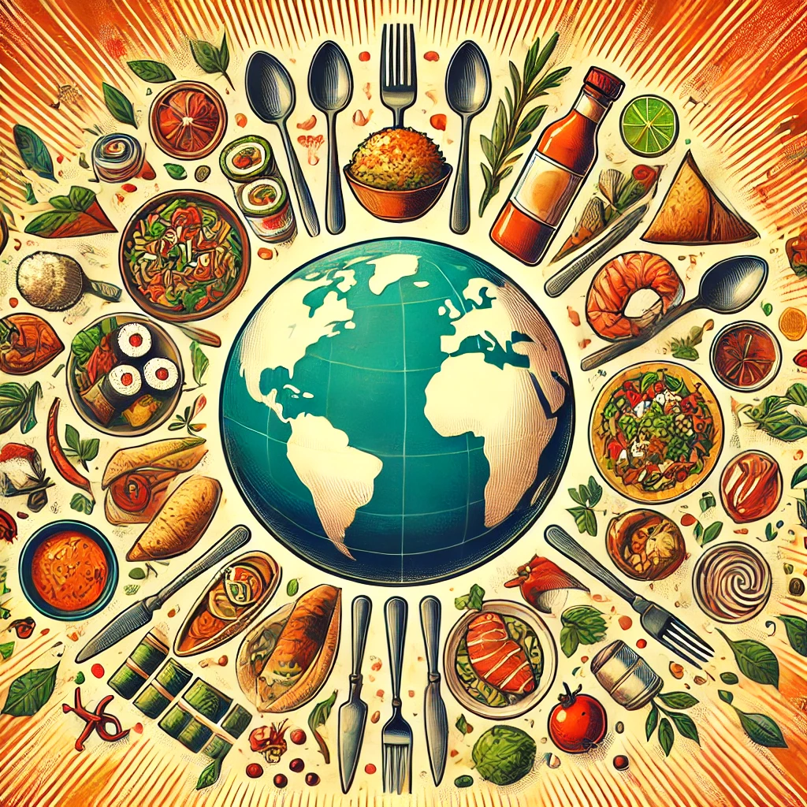

# Kulinarische Weltreise

Willkommen zu unserer kulinarischen Weltreise! Jede Woche probieren wir ein neues Gericht aus einer anderen Region der Welt aus.

## Rezepte

1. [Marokkanischer Gemüsecouscous](marokkanischer-gemuesecouscous.md)
2. [Shakshuka](shakshuka.md)
3. [Hähnchen-Fajitas](haehnchen-fajitas.md)
4. [Indisches Dal mit Reis](indisches-dal-mit-reis.md)
5. [Pad Thai mit Gemüse](pad-thai-mit-gemuese.md)
6. [Sushi-Bowl](sushi-bowl.md)
7. [Griechischer Salat mit gegrilltem Hähnchen](griechischer-salat-mit-gegrilltem-haehnchen.md)
8. [Bibimbap](bibimbap.md)
9. [Karibisches Jerk-Hähnchen mit Reis und Bohnen](karibisches-jerk-haehnchen.md)
10. [Ratatouille](ratatouille.md)
11. [Cevapcici mit Ajvar und Fladenbrot](cevapcici.md)
12. [Süßkartoffel- und Kichererbsen-Curry](suesskartoffel-kichererbsen-curry.md)
